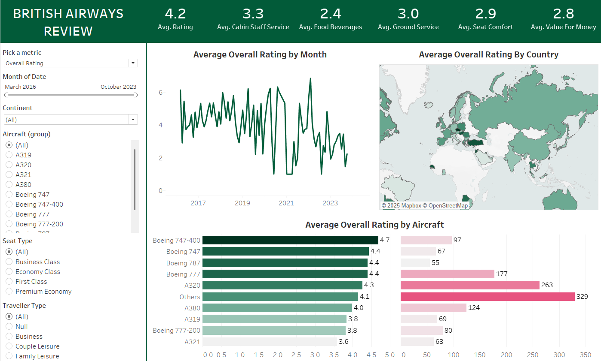

# ✈️ In-Flight Experience Analysis: A Deep Dive into Airline Customer Feedback

This repository contains the end-to-end data analysis of over 10,000 airline customer reviews. The project focuses on creating a robust ETL pipeline and an interactive dashboard to translate qualitative feedback into quantitative, actionable insights for operational improvements.

---

## 📊 Live Interactive Dashboard

The interactive dashboard, built with Tableau, allows for dynamic filtering and exploration of the dataset.

**[Click here to explore the live dashboard on Tableau Public](https://public.tableau.com/app/profile/vivo.sorhie/vizzes)**

---

## Dashboard Preview

---

## Business Objective

Airlines thrive on customer satisfaction, but unstructured review data is often difficult to act upon. The primary objective of this project was to answer the question: **"Which specific aspects of the in-flight experience, tied to particular aircraft models, are the biggest drivers of customer satisfaction and dissatisfaction?"** The goal was to provide the airline's operations team with a data-driven tool to prioritize service improvements and allocate resources effectively.

---

## Insights & Recommendations

The analysis surfaced several key findings that can be translated into strategic business decisions:

* **Capitalize on the Boeing 747-400's Success:** This aircraft consistently received the highest ratings (avg. 4.7/5).
    * **Recommendation:** Marketing should highlight the superior comfort and service on this model. Internal training can use the 747's cabin crew performance as a benchmark for fleet-wide service standards.

* **Address Critical Issues on the Airbus A321:** This model was the fleet's lowest performer (avg. 3.6/5).
    * **Recommendation:** The data overwhelmingly points to outdated "in-flight entertainment" systems as the primary pain point. A targeted upgrade of the IFE systems on the A321 fleet is the highest-impact investment to improve its ratings.

---

## Technical Workflow & Methodology

1.  **Data Extraction:** Scraped over 10,000 customer reviews from a public data source.
2.  **ETL Pipeline:** Developed a Python script using Pandas for data cleaning, transformation, and feature engineering. This involved handling missing values, standardizing text, and extracting key entities.
3.  **Data Visualization:** Connected the cleaned dataset to Tableau to build an interactive dashboard with filters for aircraft, traveller type, and date, enabling granular analysis.

---

## Tech Stack

* **Programming Language:** Python
* **Libraries:** Pandas (for data manipulation), NumPy
* **BI & Visualization:** Tableau
